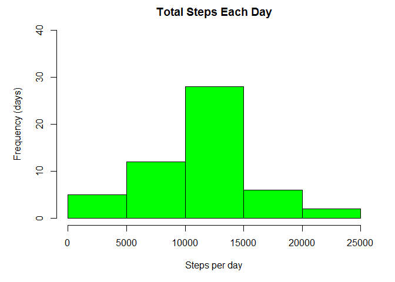
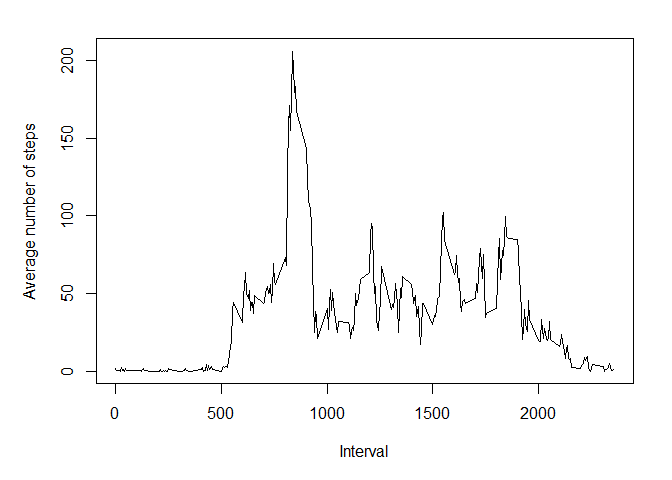
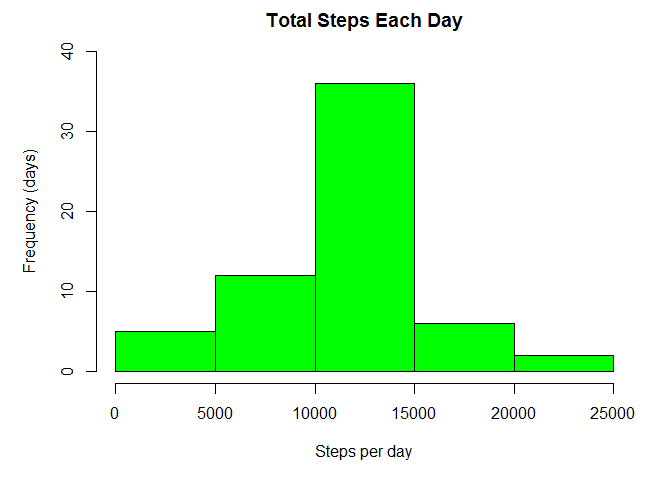
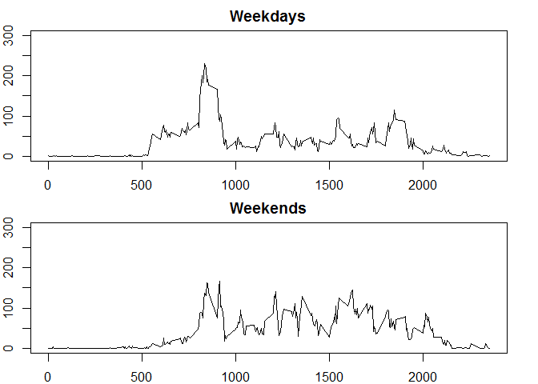

# Reproducible Research: Peer Assessment 1


## Loading and preprocessing the data


First, we will need to import the activity.csv dataset.

```r
d <- read.csv("activity.csv", stringsAsFactors=FALSE)
```

Next, we will need to load the dplyr library used in this analysis.

```r
suppressMessages(library(dplyr))
```

This dataset has three variables:  
  __date__ - date the measurement was taken  
  __interval__ - number given to the 5 minute interval in the day the measurement was taken  
  __steps__ - the number of steps for the given interval
  
The date value is a character value when imported. We will need to convert this to a date type.

```r
d1 <- mutate(d,date=as.Date(date))
```

  

## What is mean total number of steps taken per day?

To get the mean total number of steps taken per day, we will first filter out any records where the number of
steps is 'NA'. Then, since we are looking at the entire day we can just take the 'date' and 'step' columns, 
leaving out interval. We will group by the date and sum the total number of steps each day.


```r
dSummary <- d1 %>% filter(steps != "NA") %>% select(date,steps) %>% group_by(date) %>% summarise_each(funs(sum),steps) 
```

We can look at the results by creating a histogram.


```r
par(mar=c(5,5,2,2), mfrow=c(1,1))
hist(dSummary$steps, main="Total Steps Each Day",xlab="Steps per day",ylab="Frequency (days)", ylim=c(0,40),col="green")
```

 

Next, we will calculate the mean and median of the total steps taken each day.


```r
mean <- mean(dSummary$steps)
median <- median(dSummary$steps)
```

The __mean__ number of steps taken per day is 10766.19. 
The __median__ number of steps taken per day is 10765.


## What is the average daily activity pattern?

To look at the average daily activity pattern, we will need to get the avarage number of steps taken in each interval.
Again, we will remove any rows where the value for steps is 'NA'. We will then group by interval and take the
mean of the steps measurements.

```r
dSummaryInterval <- d1 %>% filter(steps != "NA") %>% select(interval,steps) %>% group_by(interval) %>% summarise_each(funs(mean),steps) 
```

To see the pattern, we will plot the average number of steps per interval as a line plot.

```r
par(mar=c(5,5,2,2), mfrow=c(1,1))
plot(dSummaryInterval$interval,dSummaryInterval$steps, type="l", xlab="Interval", ylab="Average number of steps")
```

 

Now we want to see the interval with the maximum number of steps.

```r
interval_max_steps <- dSummaryInterval[dSummaryInterval$steps==max(dSummaryInterval$steps),"interval"]
```

The interval with the maximum number of steps is: 835.

## Inputing missing values

Let's see how many 'NA' values there are for steps in the original dataset.

```r
num_missing_values <- sum(is.na(d1$steps))
```

There are 2304 missing values.

We will want to replace the missing values with the average number of steps for each interval, 
which was calculated previously in the dSummaryInterval data frame. 

To do this, we will merge the dSummaryInterval data frame with the original dataset, d1.

```r
d2 <- merge(d1,dSummaryInterval,"interval")
```

Then we will replace the value for steps in the original dataset - 'steps.x' with the average value, 
'steps.y' from dSummaryInterval.


```r
for(i in 1:length(d2$interval)) {
  if(is.na(d2[i,"steps.x"])) {
    d2[i,"steps.x"]=d2[i,"steps.y"]
  }
}
```

Now, remove the extra column and rename steps.x back to steps,


```r
d3 <- select((rename(d2,steps = steps.x)),steps,date,interval)
```

To see if there are any differences now that the missing values have been replaced, we will summarize the 
data as in the first question.

```r
dSummary2 <- d3 %>% select(date,steps) %>% group_by(date) %>% summarise_each(funs(sum),steps) 
```

Now we will plot a histogram of the sums of the steps for each day.

```r
par(mar=c(5,5,2,2), mfrow=c(1,1))
hist(dSummary2$steps, main="Total Steps Each Day",xlab="Steps per day",ylab="Frequency (days)",ylim=c(0,40),col="green")
```

 

And calculate the median and the mean.

```r
mean2 <- mean(dSummary2$steps)
median2 <- median(dSummary2$steps)
```

The __mean__ number of steps taken per day is 10766.19. 
The __median__ number of steps taken per day is 10765.


## Are there differences in activity patterns between weekdays and weekends?

To see if there are differences in the pattern of activity between weekdays and weekends we will
need to add a variable to the dataset. We will use the data frame, d3, where the missing values have 
been replaced.

Create a new variable called 'day' and use the weekdays() function to update it. This will give us
the day of the week that the measurement was taken.

```r
d4 <- mutate(d3,day=weekdays(date))
```

Next, we will update this variable with either 'Weekday' or 'Weekend' depending on the day of the week.

```r
for(i in 1:length(d4$day)) {
  if (d4[i,"day"] %in% c("Saturday","Sunday"))  {
    d4[i,"day"] <- "Weekend"
  }else {
    d4[i,"day"] <- "Weekday"}
}
```

We will summarize the weekends and weekdays and weekdays separately and get the average number of steps 
taken per interval for each.


```r
dWeekdays <- d4 %>% filter(day=="Weekday") %>% select(interval,steps) %>% group_by(interval) %>% summarise_each(funs(mean),steps)

dWeekend <- d4 %>% filter(day=="Weekend") %>% select(interval,steps) %>% group_by(interval) %>% summarise_each(funs(mean),steps)
```

Now we can plot weekends and weekdays on top of each other to compare.


```r
par(mar=c(2,2,2,2),mfrow=c(2,1))
plot(dWeekdays$interval,dWeekdays$steps, type="l", xlab="",ylab="", main="Weekdays", ylim=c(0,300))
plot(dWeekend$interval,dWeekend$steps, type="l", xlab="",ylab="", main="Weekends", ylim=c(0,300))
```

 

It looks like the average number of steps is higher in the middle of the day on weekends than on weekdays.
Also, there are more steps earlier in the day on weekdays.

